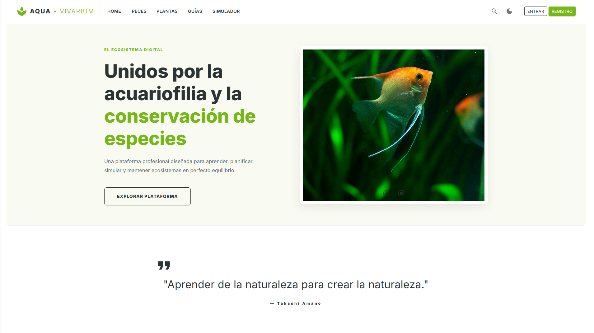

# AquaVivarium 🐟🌿


AquaVivarium es una plataforma web integral diseñada para revolucionar la gestión de ecosistemas acuáticos. Orientada tanto a acuaristas principiantes como experimentados, la aplicación permite llevar un control exhaustivo de los parámetros del agua, consultar un amplio catálogo de especies y participar en una comunidad activa.

Su funcionalidad estrella es el **Simulador de Compatibilidad Biológica**, un motor híbrido que usa lógica y procesamiento con IA que pre-valida si una especie (pez o planta) puede sobrevivir y convivir adecuadamente en función de los litros, el pH, la temperatura, entre otros parámetros y además también valida compatbilidad inter-especie.

## Características Principales

* **Gestión de Acuarios:** CRUD completo para registrar tus acuarios con parametros, habitantes y características.
* **Catálogo y Simulador:** Base de datos jerárquica de fauna y flora con validación de compatibilidad biológica en tiempo real.
* **Comunidad:** Foro integrado para resolver dudas y compartir experiencias. Además de una sección de guías y consejos para el cuidado de los acuarios.
* **Seguridad:** Autenticación y autorización basada en roles mediante ASP.NET Core Identity.
* **Diseño Responsivo:** Interfaz *Mobile First* construida con MudBlazor.

---

## Demo

[](https://aquavivarium.onrender.com/)

🔗 **Enlace directo:** [https://aquavivarium.onrender.com/](https://aquavivarium.onrender.com/)

> ⚠️ **Aviso importante sobre el rendimiento inicial:** > Al estar desplegada utilizando las capas gratuitas de Render (para la aplicación web) y Azure (para la base de datos SQL), la infraestructura entra en estado de **hibernación** tras un periodo de inactividad. 
> Si al acceder al enlace la página tarda en cargar o muestra una pantalla de carga prolongada, **por favor, espera entre 1 y 2 minutos y recarga la página**. Una vez que los servidores "despiertan", la navegación por la página será totalmente fluida.
---

## 🏗️ Arquitectura del Proyecto

El sistema está construido siguiendo los principios de **Clean Architecture** (Arquitectura Limpia), separando claramente las responsabilidades en distintas capas para facilitar su mantenimiento y escalabilidad.

```text
📦 Solución AquaVivarium
┣ 🟢 AquaVivarium (Capa de Servidor / Host / Backend)
┃ ┣ 📂 wwwroot -> (Archivos estáticos: CSS, imágenes, JS)
┃ ┣ 📂 Components -> (Componentes renderizados en servidor)
┃ ┃ ┣ 📂 Account -> (Vistas de Identity: Login, Registro)
┃ ┃ ┗ 📂 Pages
┃ ┣ 📂 Controllers -> (Endpoints de la API REST)
┃ ┗ 📂 Services -> (Lógica de negocio del servidor)
┃
┣🟢 AquaVivarium.Client (Capa de Presentación / Frontend Blazor)
┃ ┣ 📂 Components -> (Componentes UI reutilizables)
┃ ┣ 📂 Layout -> (Plantillas base y menú de navegación)
┃ ┣ 📂 Pages -> (Vistas principales de la aplicación)
┃ ┗ 📂 Services -> (Servicios HTTP para consumir la API)
┃
┣ 🟢 Data (Capa de Acceso a Datos / Infraestructura)
┃ ┣ 📂 Context -> (DbContext de Entity Framework Core)
┃ ┣ 📂 Migrations -> (Historial de cambios de la base de datos)
┃ ┗ 📂 Repositories -> (Implementación del acceso a SQL Server)
┃
┣ 🟢 Domain (Capa de Dominio / Núcleo del Negocio)
┃ ┣ 📂 Interfaces -> (Contratos compartidos entre capas)
┃ ┃ ┣ 📂 Repositories
┃ ┃ ┗ 📂 Services
┃ ┗ 📂 Models -> (Entidades base de la base de datos)
┃ ┣ 📂 DTOs -> (Objetos de Transferencia de Datos)
┃ ┗ 📂 Helpers -> (Clases de apoyo y utilidades)
┃
┗ ⊛ Scraper (Proyecto Auxiliar)
```

---

## 🗃️ Base de Datos y Modelo EER

El almacenamiento persistente recae sobre **Microsoft SQL Server**, gestionado íntegramente mediante **Entity Framework Core** utilizando un enfoque *Code-First*. 

El diseño relacional aplica estrictos principios de normalización (Tercera Forma Normal) para garantizar la integridad referencial y evitar anomalías transaccionales.

<div align="center">
  
</div>

---

## ⚙️ Requisitos Previos

Para desplegar y ejecutar el proyecto en un entorno local, necesitas tener instaladas las siguientes herramientas:

* [Docker Desktop](https://www.docker.com/products/docker-desktop/) (con el motor en ejecución).
* [Git](https://git-scm.com/downloads) para la clonación del repositorio.
* *(Opcional)* SDK de .NET 10 y Visual Studio 2026 si deseas compilar y modificar el código nativamente sin contenedores.

---


## 🐳 Ejecución en Local (Docker)
### Requisitos previos
La forma más rápida y segura de levantar el proyecto es mediante la orquestación de contenedores. El entorno incluye un *script* automatizado que genera la base de datos e inserta los datos semilla (*Seed*) sin intervención manual.
* [Git](https://git-scm.com/downloads) para la clonación del repositorio.
* [Docker Desktop](https://www.docker.com/products/docker-desktop/).


### Pasos para la ejecución
```bash
git clone https://github.com/axelcartaya/AquaVivarium
```
1. Clona el repositorio localmente.
2. Abre una terminal en el directorio raíz del proyecto.
3. Ejecuta el siguiente comando para construir las imágenes y levantar los contenedores en segundo plano:

```bash
docker-compose up -d --build
```

---

## 💻 Ejecución en Entorno de Desarrollo (Nativo)

Esta vía está pensada para abrir y modificar el código fuente utilizando las herramientas del ecosistema Microsoft.

### Requisitos previos
* [Git](https://git-scm.com/downloads) para la clonación del repositorio.
* **SDK de .NET 10** (o la versión correspondiente al proyecto).
* **Visual Studio** (2022 o 2026) con las cargas de trabajo de desarrollo web y ASP.NET.
* Una instancia local de **Microsoft SQL Server** (por ejemplo, SQL Server Express).
* Un gestor de bases de datos con soporte para como SQL Server Management Studio (SSMS)

### Pasos para la ejecución

1. **Clonación y Configuración:** Clona el repositorio localmente. En el proyecto servidor (`AquaVivarium`), localiza el archivo `appsettings.Development.json` y ajusta la cadena de conexión (`DefaultConnection`) para que apunte a tu servidor SQL local.
   
2. **Creación y Población de la Base de Datos:** Abre tu gestor de bases de datos y ejecuta el script de inicialización proporcionado en la ruta `Database/init.sql`. Este script se encarga automáticamente de generar la estructura relacional y de realizar las inserciones masivas de datos, dejando el catálogo de peces y plantas listo para su uso.
   
3. **Ejecución:** Abre la solución `.sln` en Visual Studio. Establece el proyecto servidor (`AquaVivarium`) como **proyecto de inicio**. Pulsa sobre "Iniciar sin depurar" (o usa el atajo `Ctrl + F5`). El navegador se abrirá mostrando el cliente de Blazor conectado a la API local.

---


